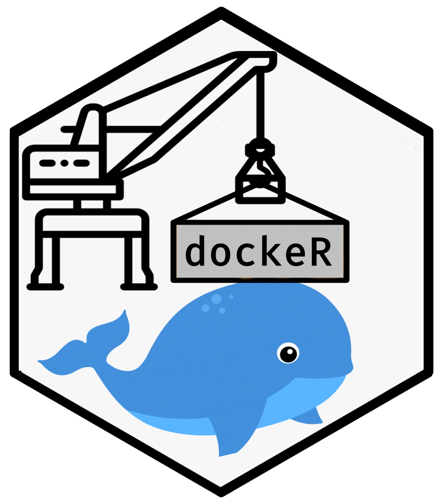

<!-- README.md is generated from README.Rmd. Please edit that file -->
# dockeR 


```{r, include = FALSE}
knitr::opts_chunk$set(
  collapse = TRUE,
  comment = "#>",
  eval = F,
  fig.path = "man/figures/README-",
  out.width = "100%"
)

```

The aim of this package is to facilitate Web Scraping with Selenium. The package proposes the following tools: 

+ Creating a new container with Selenium Installed
+ Some basic tools allowing to get informations on docker containers (name, time, type, http ports, viewing ports)
+ Some basic Selenium function aimed at making webscraping easy

# Getting Docker installed

To install docker-ce on rocker. 


# Required Packages

```{r}
library(dockeR)

```

# Running a first container

The first task to be completed with this package is to create a container. Containers can be seen as local copy (instance) of a model (image). Depending of the task you want to complete, you can choose among thousands of models (images).

Docker images are stored and shared online through docker hub. Here, I will use images from two different repository: selenium and rocker. 

## Selenium

Images from the Selenium repo allows to simulate a browser. This can be very usefull either to test websites or web applications or to scrape complex website (basically as soon as a website is not static, you cannot count on your good old friend rvest and hast to require to more complex tools such as Selenium). The repo proposes several browser: chrome, firefox, phantomjs. Each is presented in different version, but honnestly I don't get the difference between the standalone and the node version. I usually use selenium/standalone-chrome-debug which has the nice feature of opening the port 5900, which allows the see what happens in the browser. 

## Rocker
The rocker repo proposes different images containing rstudio-server with different installation of R. This is very usefull for anybody willing to set up a rstudio-server. Basically, you only  need to install docker on your server, to set up your container and you get ready-to-use server. 

## Running Containers
More expert people have broadly explained the principle of docker, so I won't dwell on it. It is important that you understand the broad architecture of what is happening. when you create a container (I don't know more and so far I have not needed to know more) Let's dive in this short description. 
A container can be seen as mini-computer simulated within another computer. If I start five containers on my computer, it is similar to having five different computers running simultaneously on my computer. Each container is able to do most of the task a computer can do, but usually they are dedicated to specific task in order to make them lighter. The specification of this mini-computer depends on the image used to build the container. If I build a container based on an image from the selenium repo, I will have a mini-computer running on debian (linux-distribution). The only programm installed on this mini-computer will be the selenium browser. I don't need anything else since this container  will only be used in order to scrape through the simulated browser. So when I scrape using a Selenium-container, I technically tells to the mini-computer (container) to connect to a website through its selenium-browser and send the information back to the major-computer. 

Similarly when you run a container built on rocker-images, you create on your server a mini-computer, which is a copy of a server with r and rstudio-server already installed on it. When you connect to the server, you are then actually redirected to the container, in which rstudio-server runs. 

## Why using container? 

I'm sure if any of you has already used Selenium, she has run into the installation problem. Updating java, finding the right binary, installing the dependencies, etc.... With docker, all of this is solved and the installation of selenium goes through the simple command : 
docker run -dtP selenium/standalone-chrome-debug
This single line creates the container, based on the image. Instead of installing selenium step after step, I simply make my own copy of a computer, on which Selenium is already installed. 

## Let's practice

When you use an image for the first time, the images is automatically downloaded locally, so that the creation of a second container based on this image is much faster. It is important to mention here that as you learn to master docker, you will download a lot of images and create a lot of container. I implemented some fucntion to keep trace of the images and container and to help you to get rid of useless instance (which occupy memorry).

Let's try it, using the the function create_container. 

The two arguments are the most important ones for Selenium : 

+ image_src specifies the images on which the container should be built. Note that similarly to github packages, we specify the docker-hub url with the repo and the image to create. If you want to install an older version, you can also specify the tag with semicolumn.
+ container_name specifies the name of the container (since you can have several containers based on the same image, this name is really important and will used all the times to interact with the container ; choose it wisely)

The function can take other arguments, which can be important if you run containers based on other images. 

```{r}
prune_containers()

# First Container
chrome <- docker$new(
  image_src = "selenium/standalone-chrome-debug", #Image to be used (model for the container)
  container_name = "chrome",
  other_arguments = "-p 4446:4444 -p 4447:5900"
  
  # Name you want to use
)

```

We can check if the container was successfully created using the list_container function. This function returns a tibble summarizing the most important informations on the created container. 

```{r}
list_container() %>%
  dplyr::glimpse()
```

Once a container has been created, it is automatically running. But you can stop it and restart it. As long as you do not remove it, the container will remain.

```{r}
chrome$stop()
chrome$start()
chrome$stop()

# stop_container("chrome")
# start_container("chrome")
# stop_container("chrome")
```

Now, I create a second and a third container.

```{r}
# Second Container
firefox <- docker$new(
  image_src = "selenium/standalone-firefox", #Image to be used (model for the container)
  container_name = "firefox" # Name you want to use
)

# Third Container
phantomJS <- docker$new(
  image_src = "nkovacs/selenium-standalone-phantomjs", #Image to be used (model for the container)
  container_name = "phantomJS" # Name you want to use
)

list_images() %>%
  dplyr::glimpse()

list_container() %>%
  dplyr::glimpse()
```

I implemented a couple of function which are usefull to get a sense of which container are existing, running and stopped. 

```{r}

existing_containers() # List the name of all existing containers
running_containers()  # List the name of all running containers
stopped_containers()  # List the name of all stopped containers

```

Containers can also be removed. 

```{r}
#Two solutions to remove containers
phantomJS$stop(remove = T)
firefox$stop()
firefox$stop(remove = T)

```

A very important parameter when dealing with docker regards the ports. Ports are literally the doors of computers and are identified with integer. Per default, all ports are close ; when we create a container we open can either expose specific ports of the container (which means opening it for any connection) or allocate specific port of the computer to specific port of the container. For instance, if I want to connect to a server installed on a container using a common http port (4444), then I need to know which port of the computer is linked to the container port 4444. When we create the container, we use the argument "P", which automatically allocate random port to each possible port of the container. To know the number of this port, we can use the function get_port in three different ways. 

```{r}
chrome %>% get_port
chrome %>% get_port(filter_port = 4444)
chrome %>% get_port(filter_port = c(4444, 5900))

```

This port are usefull to access a server or initialize a selenium browser. 

Finally, I implemented a brief function, which relies on vncviewer to open a window to visualize what is happening in the selenium browser. So far, I have only implemented one viewer, but I plan on implementing others. 

```{r}

view_container("chrome") #Since we have not yet initialize any browser, we do not see anything, but the raw container/mini-computer.
# Notice that you can throuch vncviewer interact with the container as you would interact with any computer

```

# Execute bash code within the container

Sometimes, you will need to execute bash code directly in the container (for instance to install missing libraries). DockeR includes a function allowing to run bash code in the container.

```{r}

chrome <- load_container("chrome")

chrome %>% doc_copy(from = "~/comment.png", to_cont = "/comment.png")
chrome %>% doc_copy(from_cont = "/comment.png", to = "~/comment_copy.png")

chrome %>% doc_exec("mkdir ~/new_folder")
chrome %>% doc_exec("mkdir /home/seluser/new_folder", intern = T)
chrome %>% doc_remove_folder("/home/seluser/new_folder", intern = T)

chrome %>% doc_list_file("/home/seluser/")


```


# Scraping with Selenium based on dockeR

# Initializing a rstudio-server based on dockeR

## Open a tty to interact within 
```{r}
chrome %>%
  doc_$exec("sudo apt-get update -y && sudo apt-get upgrade -y")

```

## Thanks

A huge thank you to [Favstats](https://github.com/favstats) for designing the hex-sticker. 
